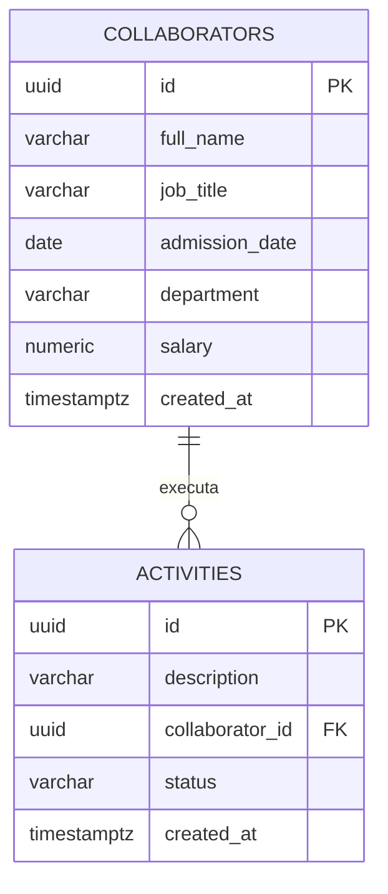
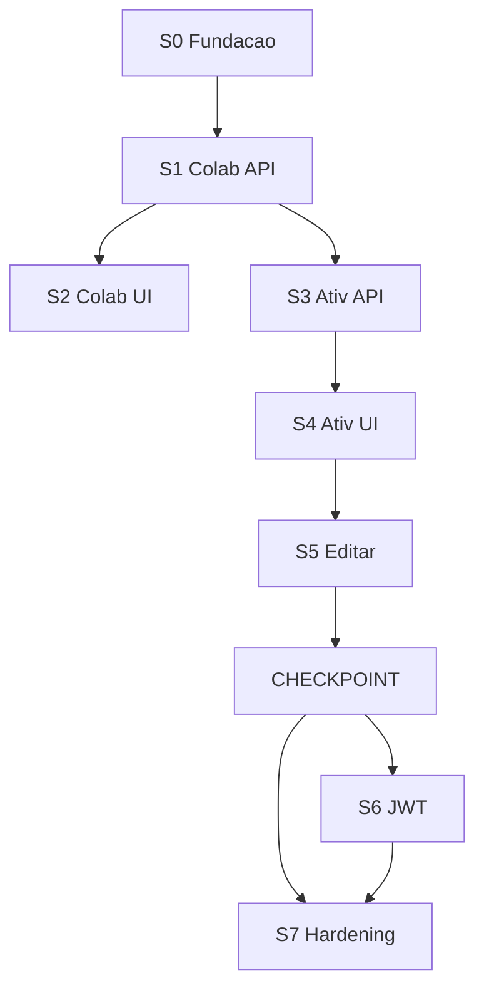

# Planning técnico final — Desafio Revex

Congelado para implementação Sprint a Sprint. Sem código nesta etapa.

**Princípio:** entender o problema antes de melhorar o problema.

Não é WFM. Não é ERP. É o problema da Revex, modelado com clareza, com uma extensão pequena e bônus depois do núcleo.

Fonte A: enunciado (Partes 1–2, Bônus) + edição de atividade confirmada. [PROJECT_RULES.md](PROJECT_RULES.md) regula *como* construir, não inventa regra de produto.

---

## 1. Resumo executivo

Aplicação web: colaboradores (criar, validar, listar, filtrar por setor, detalhar) e atividades (criar com descrição e colaborador, listar, filtrar por colaborador ou status, concluir, **editar só a descrição**).

Uma extensão: **iniciar** (`PENDENTE → EM_ANDAMENTO`) para o estado do filtro ter caminho. Não é “a Revex pediu iniciar”.

Bônus depois do checkpoint: paginação (contrato) e JWT.

```text
S0 Fundação → S1/S2 Colaboradores → S3/S4 Atividades → S5 Edição
→ CHECKPOINT (obrigatório completo)
→ S6 JWT (opcional) → S7 Hardening
```

Stack: Java 21 / Spring Boot 3, React + TS + Vite, PostgreSQL 16, Git. Ambiente local: Node 22 e Docker ok; JDK via SDKMAN na S0.

---

## 2. Classificação A / B / C / D

| | Nome | Uso |
|---|---|---|
| **A** | Requisito explícito | Enunciado ou confirmação do desafio (inclui editar atividade). |
| **B** | Regra implícita necessária | Sem ela um A quebra. |
| **C** | Extensão funcional | Não pedida. Etiqueta + justificativa + impacto. Nunca vender como A. |
| **D** | Decisão técnica | Stack, persistência, UX. Nunca vender como regra de negócio. |

---

## 3. Requisitos explícitos (A)

**Colaboradores:** cadastrar (nome completo, cargo, data de admissão, setor, salário); validar dados; salário positivo; listar; filtrar por setor; ao clicar, ver todos os campos.

**Atividades:** cadastrar com descrição detalhada; associar a um colaborador; listar; filtrar por colaborador; filtrar por status (`PENDENTE`, `EM_ANDAMENTO`, `CONCLUIDA`); marcar como concluída; **editar atividade, incluindo a descrição**.

**Edição (A, fechada):** no MVP altera **somente** `description`. Não altera `status`, `collaboratorId`, `id`, `createdAt`. Atividade `CONCLUIDA` **pode** ter a descrição editada e **permanece** `CONCLUIDA`. Editar texto ≠ reabrir.

**Bônus (não bloqueiam o núcleo):** JWT; paginação nas listagens; Spring + React; Git; Postgres ou MySQL; testes unitários.

---

## 4. Regras implícitas (B)

| ID | Regra | Por quê existe |
|---|---|---|
| B-01 | Colaborador da associação deve existir | Senão “associar a um colaborador” é mentira. |
| B-02 | Atividade nova nasce `PENDENTE` | Filtro por status precisa de valor inicial. |
| B-03 | Concluir `CONCLUIDA` de novo é inválido | Segunda conclusão não muda o domínio. |
| B-04 | `CONCLUIDA` não transita para outro status | Não há operação de reabrir. |
| B-05 | Id inexistente → 404 | Detalhe/ações sobre recurso que não existe. |
| B-06 | Item da lista de atividades traz id + nome do colaborador | Filtro/associação sem tela de detalhe de atividade. |
| B-07 | Detalhe do colaborador = os cinco campos do cadastro | “Todos os campos”. |

`EM_ANDAMENTO` no filtro, sem operação de início no enunciado = **lacuna**. Fechada por C-01, não por requisito “iniciar”.

---

## 5. Extensões funcionais (C)

| ID | O quê | Justificativa | Impacto | Não é |
|---|---|---|---|---|
| **C-01** | `PENDENTE → EM_ANDAMENTO` via `PATCH .../start` | O enunciado *nomeia* `EM_ANDAMENTO` no filtro. Sem caminho, o filtro é morto. Extensão pequena e isolada. | +1 UC, +1 rota, +1 botão, +testes. Só `activity`. | Pedido da Revex |
| **C-02** | JWT | Bônus do enunciado. Depois do checkpoint. | S6 inteira. User ≠ Collaborator. | Requisito do núcleo |
| **C-03** | Paginação `page/size` + totais | Bônus. Núcleo de listagem funciona sem ela (lista completa ou default técnico). | Query opcional + DTO. | Regra de negócio |

Sem pausa, reabertura, cancelamento, histórico de status, auditoria de transição.

---

## 6. Casos de uso

Pré comum: app no ar. JWT (S6+): Bearer, exceto login.

### UC-01 Cadastrar colaborador — A — S1/S2

- **Entrada:** cinco campos. **Fluxo:** form → validação UX → API → persistir → 201 → sucesso.
- **Erros:** 400 (vazio após trim, salário ≤ 0, tipo inválido).

### UC-02 Listar colaboradores — A — S1/S2

- **Entrada:** `department` opcional; `page`/`size` se C-03. **Fluxo:** lista; vazio se não houver. Clique → UC-03.

### UC-03 Detalhar colaborador — A — S1/S2

- **Entrada:** id. **Resultado:** cinco campos. **Erro:** 404.

### UC-04 Cadastrar atividade — A — S3/S4

- **Pré:** existe colaborador. **Entrada:** descrição + `collaboratorId`. **Resultado:** `PENDENTE`. **Erros:** 400; 404 (B-01).

### UC-05 Listar atividades — A — S3/S4

- **Entrada:** `collaboratorId` e/ou `status`. **Fluxo:** lista com nome do colaborador. Sem tela de detalhe.

### UC-06 Concluir — A — S3/S4

- **Pré:** não `CONCLUIDA`. **Entrada:** id da linha. **Resultado:** `CONCLUIDA`. **Erros:** 404; 422 (B-03).

### UC-07 Iniciar — C-01 — S3/S4

- **Pré:** `PENDENTE`. **Resultado:** `EM_ANDAMENTO`. **Erros:** 404; 422 se não `PENDENTE`.

### UC-08 Editar descrição — A — S5

- **Entrada:** `{ description }` no `PATCH /api/activities/{id}`. Feito na listagem (modal/inline). Sem `GET /activities/{id}`.
- **Regras:** só descrição; `status` e `collaboratorId` inalterados; `CONCLUIDA` continua `CONCLUIDA`.
- **Erros:** 400 descrição vazia/acima do teto técnico; 404; 400/422 se o body trouxer campos proibidos.

### UC-09 Login — C-02 — S6

- **Entrada:** username, password. **Resultado:** JWT. **Erro:** 401.

---

## 7. Regras de domínio (só o que o código deve impor)

**A:** RN-E1 cinco campos; RN-E2 salário > 0 e validação de entrada; RN-E3 filtro setor; RN-E4 detalhe completo; RN-E5 descrição; RN-E6 associação; RN-E7 filtros de atividade e três status; RN-E8 concluir; RN-E9 editar descrição.

**B:** B-01 a B-07.

**C:** C-01 somente `PENDENTE → EM_ANDAMENTO`.

**Transições (fechadas):**

```text
PENDENTE      → EM_ANDAMENTO   (C-01 /start)
PENDENTE      → CONCLUIDA      (/complete)
EM_ANDAMENTO  → CONCLUIDA      (/complete)
CONCLUIDA     → *              proibido
```

Editar descrição **não** é transição.

---

## 8. Restrições técnicas (D) — não são RH

| Alvo | Limite | Motivo |
|---|---|---|
| nome, cargo, setor | obrigatório, trim, varchar(255) | Teto de coluna. Vazio após trim = inválido. Sem mínimo 3/2. |
| admissão | `date` obrigatória | Tipo. **Não** proibir futuro. |
| salário | `numeric(12,2)`, `> 0` | RN-E2 + escala. Teto do tipo ≠ teto salarial da empresa. |
| descrição | obrigatória, trim, varchar(2000) | “Detalhada”; teto técnico. Sem mínimo 5. |
| status | os três valores | RN-E7. |
| id | UUID | Identidade ≠ sequência. Adequado ao tamanho do projeto. **Não** é “segurança”. |

---

## 9. Modelo de dados

Cada coluna tem necessidade. Sem `active`, `completed_at`, `updated_at`, `deleted_at`, `status_history`.

### collaborators

| Coluna | Tipo | Cat. | Por quê |
|---|---|---|---|
| `id` | UUID PK | D | Identidade persistida. |
| `full_name` | varchar(255) | A | Nome completo. |
| `job_title` | varchar(255) | A | Cargo. |
| `admission_date` | date | A | Sem hora: evita fuso. |
| `department` | varchar(255) | A | Setor **String**. Sem enum/tabela/CRUD. Filtro `ILIKE`+trim = D. |
| `salary` | numeric(12,2) | A | CHECK `> 0`. |
| `created_at` | timestamptz | D | Ordem determinística + rastreio mínimo. |

### activities

| Coluna | Tipo | Cat. | Por quê |
|---|---|---|---|
| `id` | UUID PK | D | Identidade. |
| `description` | varchar(2000) | A | Criar e editar. |
| `collaborator_id` | UUID FK | A | Associação. Sem CASCADE. |
| `status` | varchar(20) | A | CHECK nos três. Conclusão = este campo. |
| `created_at` | timestamptz | D | Ordem da lista. |

S5 **não** cria migration (só muda `description`).

### users — só se S6

`id`, `username` unique, `password_hash`, `created_at`. Módulo `auth`. User ≠ Collaborator.

Índices (D, pelos filtros A): `department`, `collaborator_id`, `status`.



---

## 10. Arquitetura backend

**D — Modular Monolith.** Proporcional. Sem hexágono, filas, microsserviços.

| Módulo | Sprint | Papel |
|---|---|---|
| `collaborator` | 1 | UC-01–03 |
| `activity` | 3, 5 | UC-04–08 |
| `shared` | 1 | Erros + `PageResponse` (C-03) |
| `auth` | 6 | UC-09. Inexistente até o bônus |

Controller (HTTP + Bean Validation) → Service (caso de uso) → Repository. Entity ≠ DTO.

**D:** `ActivityService` → `CollaboratorService`. Nunca `CollaboratorRepository`. Sem porta extra.

`ActivityStatus` + `complete()` / `start()` na entity. `@Transactional` só em escrita.

---

## 11. Arquitetura frontend

React + TS strict + Vite. Feature-based.

```text
src/app/
src/features/collaborators/
src/features/activities/
src/features/auth/          # S6
src/shared/api/
src/shared/ui/              # só reuso real
src/shared/format/          # moeda
```

**D fechadas:** `fetch` + hooks; forms controlados; React Router (lista → detalhe colaborador); CSS Modules; `<input type="date">`. Sem TanStack Query, Redux, Zustand, RHF, Zod, MUI, Tailwind.

Estados: loading, vazio, erro, sucesso, validação, ação em curso.

---

## 12. Estrutura de pastas

```text
revex-challenge/
  README.md
  docker-compose.yml          # só Postgres
  docs/                       # cresce quando agregar valor
  backend/                    # Maven
    src/main/java/com/revex/challenge/{collaborator,activity,shared,auth}
    src/main/resources/db/migration/
  frontend/src/{app,features,shared}/
```

---

## 13. APIs

Sem rota “porque REST”.

| Método | Rota | UC | Justificativa |
|---|---|---|---|
| POST | `/api/collaborators` | 01 | Criar. 201 |
| GET | `/api/collaborators` | 02 | Lista + filtro setor |
| GET | `/api/collaborators/{id}` | 03 | Detalhe pedido no enunciado |
| POST | `/api/activities` | 04 | Criar. 201 / 404 |
| GET | `/api/activities` | 05 | Lista + filtros; item inclui colaborador `{id,fullName}` |
| PATCH | `/api/activities/{id}/start` | 07 | C-01 |
| PATCH | `/api/activities/{id}/complete` | 06 | Concluir. Não é update genérico de status |
| PATCH | `/api/activities/{id}` | 08 | Só `{ description }` |
| POST | `/api/auth/login` | 09 | Só S6 |

**Não existem:** `GET/DELETE /api/activities/{id}`, `PUT /api/activities/{id}`, `PATCH .../status`, CRUD de user, `/health` como feature.

Body de `PATCH /{id}` com `status` ou `collaboratorId` → 400. Ignorar silenciosamente é pior (esconde erro).

`PageResponse<T>`: `{ content, page, size, totalElements, totalPages }`. Sem expor `Page` do Spring. Sem framework de paginação.

`ApiErrorResponse`: `{ timestamp, status, message, fieldErrors? }`.

---

## 14. Autenticação (C-02)

Depois do checkpoint. S1–S5 sem Security de verdade.

Se S6: JWT HS256, `JWT_SECRET` em env, BCrypt, um seed, login público, resto protegido. Sem cadastro, recovery, RBAC. Sem `/health` no desenho de auth.

`shared/api` (S2) já aceita header opcional — D, custo zero.

Núcleo é entregável **sem** JWT.

---

## 15. Validação

| Camada | Papel |
|---|---|
| Frontend | UX: obrigatórios, salário > 0, status do filtro, descrição no edit |
| Backend | Autoridade: Bean Validation + B-01/B-03/C-01 + PATCH estreito |
| Banco | NOT NULL, FK, CHECK salário, CHECK status |

`salary > 0` nas três é intencional (A). Não copiar mínimos inventados para o SQL.

---

## 16. UX e máscaras

**Salário (D):** UI `R$ 1.234,56` → JSON number `1234.56` → `BigDecimal` → `numeric(12,2)`. Nunca string formatada. Um parser em `shared/format`.

**Data (D):** `<input type="date">`. ISO. Sem máscara `dd/mm/aaaa`.

Setor: texto livre + filtro case-insensitive.

Lista de atividades: editar na linha; Iniciar se `PENDENTE`; Concluir se não `CONCLUIDA`.

---

## 17. Erros

Handler global em `shared`. Sem try/catch espalhado.

| HTTP | Quando |
|---|---|
| 400 | Validação, JSON, status de filtro, campos proibidos no PATCH |
| 401 | Só com JWT |
| 404 | Colaborador ou atividade inexistente |
| 422 | Transição inválida (já concluída; start fora de `PENDENTE`) |
| 500 | Inesperado: log com stack; cliente vê mensagem neutra |

401 não existe no núcleo sem S6.

---

## 18. Testes

Comportamento e risco.

**Unit:** salário > 0; `start` só de `PENDENTE`; `complete` e 2ª conclusão; edição muda descrição e **não** muda status/colaborador; `CONCLUIDA` + edit continua `CONCLUIDA`; parser de moeda; JWT só se S6.

**Integration (Postgres / Testcontainers):** criar/listar/detalhar colaborador; filtro setor; criar atividade; colaborador inexistente → 404; filtros; start; complete 2× → 422; PATCH descrição; PATCH em concluída; PATCH com `status`/`collaboratorId` → 400; S6 401.

Sem H2.

**Smoke (checkpoint / S7):** criar colaborador → listar → filtrar → detalhar → criar atividade → filtrar → iniciar → concluir → editar descrição. Login só se S6.

Frontend: funções puras (moeda, validação). Sem E2E.

---

## 19. Banco e migrations

Postgres 16 no compose. Flyway. `ddl-auto=validate`. Não editar migration aplicada.

| Sprint | Migration |
|---|---|
| 1 | `V1__create_collaborators.sql` |
| 3 | `V2__create_activities.sql` |
| 5 | nenhuma |
| 6 | `V3__create_users.sql` + seed |

S0: compose + app sobe. Flyway pode aplicar zero versões até S1.

---

## 20. Sprints

S0 **enxuta**: executável, não documental.



| Sprint | Incremento utilizável |
|---|---|
| **0** | `compose up` + API sobe + React sobe + README de como rodar |
| **1** | Colaboradores via HTTP: criar, validar, listar, filtro, detalhe |
| **2** | Mesmo fluxo na UI + máscara + estados |
| **3** | Atividades via HTTP: criar, listar, filtros, start, complete |
| **4** | Mesmo fluxo na UI |
| **5** | Editar descrição (também se concluída) + testes. **Núcleo A completo.** |
| **CP** | Smoke do obrigatório. Sem JWT. |
| **6** | JWT se houver tempo |
| **7** | Smoke, limpeza, docs úteis, Git. **Sem feature nova.** |

S3 depende de S1. S4 depende de S2+S3. S5 depende de S4. S6 não bloqueia entrega do núcleo.

---

## 21. Go / No-Go

Não avança no “parece ok”. Functional / Quality / Architecture / Project. Build, testes da Sprint, lint/typecheck, diff só do incremento, Conventional Commits em inglês, zero dependência sem motivo.

| | Functional | Quality | Architecture | Project |
|---|---|---|---|---|
| **S0** | Postgres + API + UI sobem | build/lint UI | pastas combinadas | README mínimo |
| **S1** | POST/GET/filtro/detalhe; salário ≤0 → 400 | unit + integration | entity não vaza | sem `active` |
| **S2** | máscara grava número; detalhe com refresh | `tsc` | um `shared/api` | estados UI |
| **S3** | 404 colaborador; start; complete 2× → 422 | matriz de status | Service, não Repository cruzado | C-01 rotulada C |
| **S4** | criar → filtrar → start → complete | — | sem GET detalhe atividade | botões por status |
| **S5** | edit; concluída permanece concluída; campos extras → 400 | testes de edit | PATCH estreito | **checkpoint** |
| **S6** | 401 sem token; login | testes JWT | User ≠ Collaborator | seed no README |
| **S7** | smoke registrado | suíte verde | sem lib extra | escopo intacto |

**Não começar S6 se o núcleo (S5) estiver incompleto.**

---

## 22. Documentação

Proporcional. S0 = README (objetivo, stack, como rodar, como testar). Seed só se S6.

Outros arquivos **quando** a Sprint os precisar: `docs/PLANNING.md` (cópia deste mapa), DOMAIN (A/B/C), ARCHITECTURE (módulos), API (rotas reais), SMOKE (checkpoint).

ADRs só: Modular Monolith, Flyway, UUID, JWT se S6. Sem ADR para `type=date`.

---

## 23. Riscos

| Risco | Mitigação |
|---|---|
| JDK ausente / `sudo` | SDKMAN na S0; fallback Docker |
| Moeda | um parser testado + integration no `numeric` |
| Data/fuso | `LocalDate` / `date`; JS não usa `new Date()` para ISO date |
| C-01 na entrevista | Frase pronta do §27 |
| PATCH largo | Body só `description`; resto 400 |
| Escopo / tempo | Checkpoint antes do JWT |
| JWT no fim | Header opcional desde S2 |
| Testcontainers | Docker já ok; compose como fallback. Sem H2 |

---

## 24. Decisões fechadas

Não há **DECISÃO PENDENTE**.

| Tema | Cat. | Decisão |
|---|---|---|
| Editar | A | Obrigatório. Só `description`. S5 |
| Edit em `CONCLUIDA` | A+D de política | Permitido; status permanece |
| Trocar colaborador no edit | — | Não |
| Start | C-01 | Adotada. Isolada |
| Paginação | C-03 | DTO próprio; núcleo vive sem ela |
| JWT | C-02 | S6, após CP |
| Setor | D | String + trim + `ILIKE` |
| `created_at` | D | Fica (ordem) |
| `active` / `completed_at` / `updated_at` | — | Fora |
| UUID | D | Fica; não é segurança |
| GET activity | — | Não existe |
| Fetch, forms, date, CSS Modules, Maven, Testcontainers, Flyway, `validate` | D | Adotadas |
| Transições | §7 | Só as três setas |

---

## 25. Decisões pendentes

Nenhuma. Planning congelado.

---

## 26. Fora de escopo

Inativar/excluir colaborador; editar colaborador; excluir atividade; `GET /activities/{id}`; CRUD/enum/tabela de setor; `completed_at`, `updated_at`, `active`, histórico de status; reabrir/pausar/cancelar; User = Collaborator; cadastro de user; RBAC; recovery; relatórios; notificações; previsão; escalas; WFM; microsserviços; Kafka; Redis; CQRS; Event Sourcing; GraphQL; Kubernetes; Elasticsearch; filas; hexágono; TanStack/RHF/Zod/MUI/Tailwind/Redux; H2.

**Editar atividade não está aqui.** É A. S5.

---

## 27. Auditoria cruzada

| Requisito A | UC | Regra | Persistência | API | UI | Teste | Sprint | Go |
|---|---|---|---|---|---|---|---|---|
| Criar colaborador | 01 | E1, E2 | collaborators | POST | form S2 | unit+int | 1–2 | S1/S2 |
| Cinco campos | 01, 03 | E1, E4 | colunas | body/response | form + detalhe | int | 1–2 | |
| Salário positivo | 01 | E2 | CHECK | 400 | máscara | unit+int | 1–2 | |
| Listar + filtro setor | 02 | E3 | `department` | GET + query | lista + input | int | 1–2 | |
| Detalhe | 03 | E4, B-05 | id | GET {id} | página | int | 1–2 | |
| Criar atividade | 04 | E5, E6, B-01, B-02 | activities | POST | form | int | 3–4 | |
| Listar + filtros | 05 | E7, B-06 | status, FK | GET | lista + filtros | int | 3–4 | |
| Três status | 05–07 | E7, C-01 | CHECK | query + start/complete | badges/ações | unit | 3–4 | |
| Concluir | 06 | E8, B-03, B-04 | `status` | PATCH /complete | botão | unit+int | 3–4 | |
| Editar descrição | 08 | E9 | `description` | PATCH /{id} | modal/inline | unit+int | 5 | S5/CP |

**Inversa — por que cada peça existe**

| Peça | Por quê | Se não |
|---|---|---|
| `created_at` | D ordem | Lista instável |
| C-01 `/start` | Estado do filtro viver | `EM_ANDAMENTO` morto |
| `PageResponse` | C-03 | Sem paginação o GET ainda lista |
| `shared` | Erro + page sem domínio | Duplicar handler |
| `CollaboratorService` no activity | B-01 sem vazar repository | Acoplamento de persistência |
| Máscara salário | D UX; JSON number | Bug `1.234,56` |
| `input date` | D ISO | Lib inútil |
| UUID | D identidade | Sem requisito de BIGINT |
| users | só C-02 | Sem JWT, sem tabela |
| CSS Modules | D | Sem Tailwind |

Nada no mapa sem essa linha.

---

## 28. Narrativa de entrevista

1. **A** — o que a Revex pediu, mais edição de descrição confirmada.
2. **B** — colaborador existe, status inicial, 404, concluída não reabre, lista com nome.
3. **C** — start para `EM_ANDAMENTO` do filtro existir; JWT e paginação como bônus.
4. **D** — monolith, Flyway, UUID, `fetch`, CSS Modules, `LocalDate`, `BigDecimal`.
5. **Recusado** — inativação, `completed_at`, detalhe GET, CRUD de setor, WFM, libs.

> “Eu não tentei transformar um teste de CRUD em uma plataforma WFM. Primeiro resolvi o problema apresentado. Depois fiz poucas extensões pequenas, explícitas e justificáveis.”

Frase do start: o enunciado apresenta `EM_ANDAMENTO` como estado filtrável; para esse estado ter caminho operacional, adotamos `PENDENTE → EM_ANDAMENTO`. Isso não é “a Revex pediu iniciar”.

O desenvolvedor explica cada módulo e cada etiqueta.

---

Planning congelado. Sprint 0 concluída (GO). Próxima: Sprint 1.
